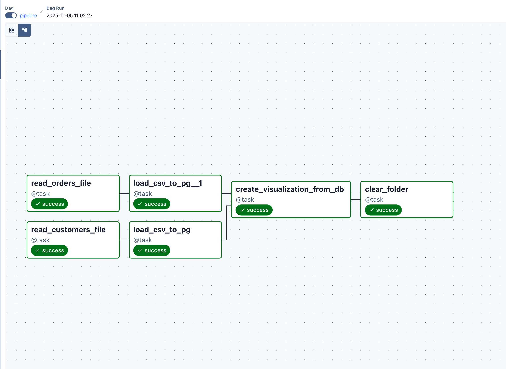
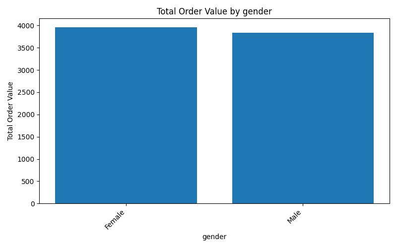
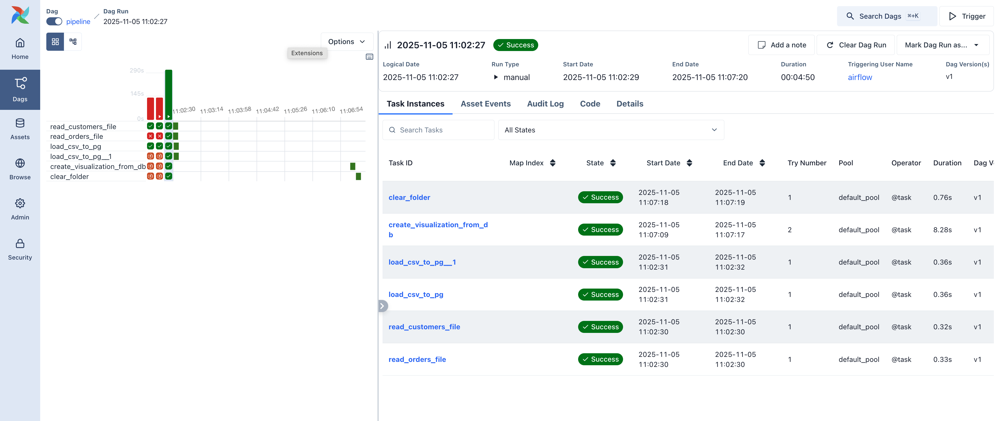

# 📊 Customer Orders Data Pipeline (Apache Airflow + PostgreSQL)

This project implements an **end-to-end ETL and visualization pipeline** using **Apache Airflow** to automate ingestion, loading, and analytics of customer order data.
It reads CSV files (`Customers.csv` and `Orders.csv`), loads them into **PostgreSQL**, generates a **visual summary of order totals by gender**, and cleans up temporary files — all orchestrated by Airflow.

---

## 🧭 Project Overview

The goal of this pipeline is to demonstrate a **modular and automated data workflow** for analytics teams.

The DAG performs the following operations:

1. **Read input CSVs** — `Customers.csv` and `Orders.csv`
2. **Load data into PostgreSQL** (creates schema and tables if not present)
3. **Join tables and analyze data** (aggregate order totals by gender or age group)
4. **Generate visualization** 
5. **Clean up intermediate files** while preserving results

The DAG runs **once on demand** (`@once` schedule), simulating a mini ETL cycle from ingestion to visualization.

---

## ⚙️ Architecture

### **High-Level Workflow**

```
┌─────────────────────────────┐
│ 1️⃣ Read Customers.csv       │
└──────────────┬──────────────┘
               ▼
┌──────────────┴──────────────┐
│ 2️⃣ Read Orders.csv          │
└──────────────┬──────────────┘
               ▼
┌──────────────┴──────────────┐
│ 3️⃣ Load to PostgreSQL       │
│     - Customers             │
│     - Orders                │
└──────────────┬──────────────┘
               ▼
┌──────────────┴──────────────┐
│ 4️⃣ Create Visualization     │
│     (order_total_by_gender) │
└──────────────┬──────────────┘
               ▼
┌──────────────┴──────────────┐
│ 5️⃣ Cleanup Folder           │
└─────────────────────────────┘
```




## Tech Stack

| Component          | Purpose                                        |
| ------------------ | ---------------------------------------------- |
| **Apache Airflow** | Workflow orchestration and task scheduling     |
| **PostgreSQL**     | Central database for structured data storage   |
| **Pandas**         | Data manipulation and SQL query handling       |
| **Matplotlib**     | Visualization generation (bar charts)          |
| **Docker Compose** | Local container orchestration for Airflow & DB |
| **Python 3.12**    | Core scripting and DAG definition              |

---


## 📦 DAG Design & Tasks

### **DAG ID:** `pipeline`

| Step | Task ID                        | Description                                        | Output                      |
| ---- | ------------------------------ | -------------------------------------------------- | --------------------------- |
| 1️⃣  | `read_customers_file`          | Locate and validate `Customers.csv`                | Path to file                |
| 2️⃣  | `read_orders_file`             | Locate and validate `Orders.csv`                   | Path to file                |
| 3️⃣  | `load_csv_to_pg`               | Load both CSVs into Postgres | Database tables             |
| 4️⃣  | `create_visualization_from_db` | Join data, aggregate totals, create bar chart      | `order_total_by_gender.png` |
| 5️⃣  | `clear_folder`                 | Clean up non-visualization files                   | Clean workspace             |


## 🧮 Data Flow Summary

**Input Files:**

* `/opt/airflow/data/Customers.csv`
* `/opt/airflow/data/Orders.csv`

**Database Tables:**

* `Customers`
* `Orders`

**Visualization Output:**

* `/opt/airflow/data/visualizations/order_total_by_gender.png`

**Logs & Metadata:**

* Stored under `/opt/airflow/logs/`


## 📈 Sample Visualization

The generated bar chart aggregates order totals by gender (if available), or by **age group buckets** if gender data is missing.




## 🚀 Deployment Guide

### 1️⃣ Clone the Repository

```bash
git clone https://github.com/pb0104/customer-orders-pipeline.git

cd customer-orders-pipeline
```

### 2️⃣ Start the Airflow Environment

```bash
docker-compose up -d
```

This launches:

* Airflow Webserver → [http://localhost:8080](http://localhost:8080)
* Airflow Scheduler
* PostgreSQL Database

### 3️⃣ Add Data Files

Place your input CSV files in:

```bash
/opt/airflow/data/Customers.csv
/opt/airflow/data/Orders.csv
```

*(If file name differs, adjust inside `read_orders_file` or rename accordingly.)*

### 4️⃣ Access Airflow UI

Login with default credentials and trigger the DAG manually:

```
DAGs → pipeline → ▶️ Trigger DAG
```

Alternatively, run from terminal:

```bash
docker exec -it docker-airflow-scheduler-1 airflow dags trigger pipeline
```


## 🧹 Automatic Cleanup

After visualization creation, the DAG **clears non-essential files** in the `/data` directory, preserving:

* `/data/visualizations/`
* Generated plots

Logs remain intact for auditing and debugging purposes.


##  Key Learnings

* Demonstrates **ETL orchestration** using Airflow’s TaskFlow API
* Handles **data ingestion, transformation, and visualization** seamlessly
* Shows **Postgres integration** via Airflow’s `PostgresHook`
* Incorporates **automated cleanup** for reproducible and maintainable workflows


## 📂 Repository Structure

```
IDS706_WEEK10_APACHE_AIRFLOW/
│
├── .devcontainer/               # VSCode container setup
│   ├── Dockerfile
│   └── db.env
|   └── docker-compose.yml           #Multi-container Airflow + Postgres setup
|  
├── config/
│   └── airflow.cfg
├── dags/
│   └── pipeline.py              # Main DAG file
├── data/
│   ├── Customers.csv
│   ├── Orders.csv
│   └── visualizations/
│       └── order_total_by_gender.png
├── logs/                        # Airflow runtime logs
├── screenshots/
│   ├── dag_view.png
│   ├── dag_run.png
│   └── viz_order_total_by_gender.png
└── requirements.txt
```


## 🌟 Example DAG Run

### Successful DAG Execution



All tasks (read → load → visualize → cleanup) executed successfully in parallelized fashion.


## 🔮 Future Enhancements

* Enable **daily scheduled runs** (`@daily`) for continuous ingestion
* Add **data validation checks** using Great Expectations
* Extend visualization to include **order trends by age bucket**
* Integrate a **Streamlit dashboard** to visualize Airflow outputs interactively
